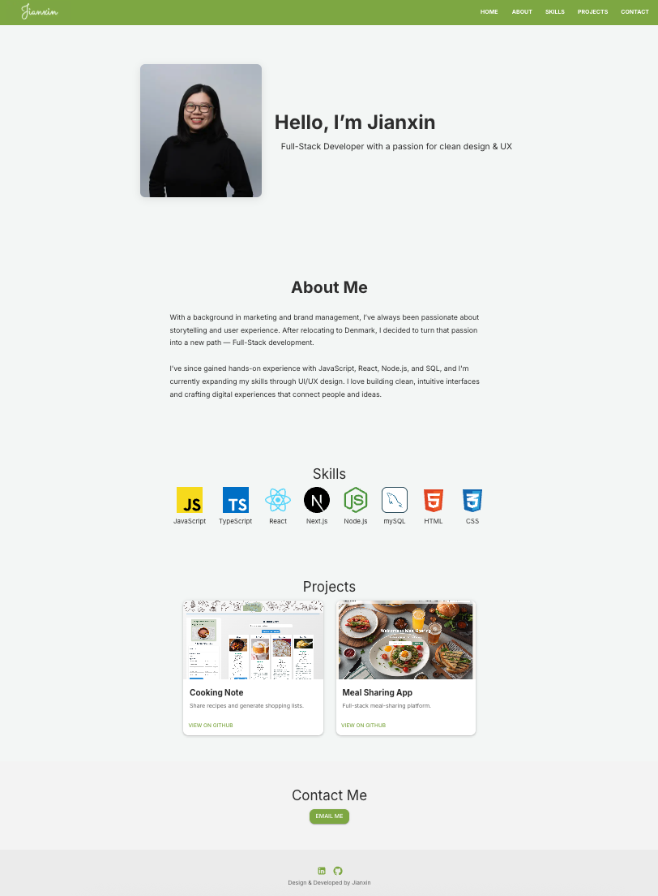

# Jianxin's Developer Portfolio

Welcome to my personal developer portfolio built with **Next.js**, **TypeScript**, and **Material UI**. This site showcases my journey from marketing into web development, featuring my skills, projects, and contact information.

## 🔗 Live Site

[Visit my portfolio](#)

## 🚀 Tech Stack

- **Framework**: [Next.js](https://nextjs.org/)
- **Language**: TypeScript
- **Styling**: [Material UI](https://mui.com/)
- **Icons**: MUI Icons
- **Deployment**: Vercel / GitHub Pages

## 👩🏻‍💻 About Me

I have a background in marketing and brand management and recently transitioned to full-stack development in Denmark. I'm currently learning UI/UX and enjoy building intuitive, user-focused digital experiences.

## 📷 Screenshots

 

## 📬 Contact

Feel free to reach out:

- 💻 [GitHub](https://github.com/jianxinz233)

---

## 🛠️ Getting Started (For Developers)

```bash
# Install dependencies
npm install

# Run the dev server
npm run dev
```
